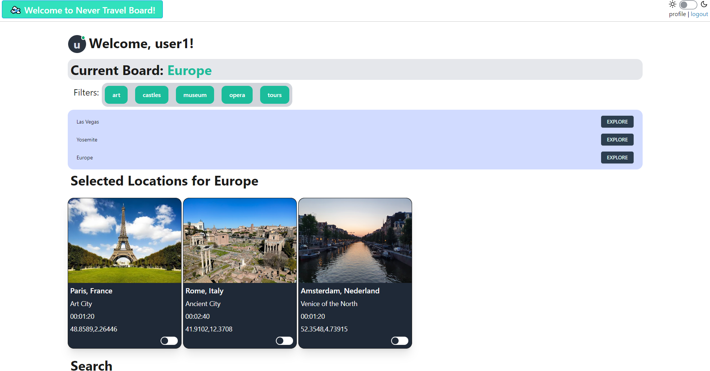

# ✈️Never Travel Board✈️

## **User Story**
As a travel enthusiast seeking new experiences,
I want to store setauls about my trip destinations and specific places within those locations,
so that I can plan my itinerary effectively and maximize my travel experiences.

|**I Want...**                  |**So that...**                                      |
|----------------------------------------------------------------------|-------------------------------------------------------------------------------------------|
|To be able to have all my travel destinations in once place |  I can see my pinned places to visit within my travel destinations.                                        |

|**When...**                           |**Then...**                                                |
|----------------------------------------------------------------------|--------------------------------------------------------------
|                  I click "New Trip"                                  |     I can input my travel destination                             |
|                                       I can place filters on the travel destinations          |         I will be prompted with places in regaurd to those filters                                  |
|                   I save the locations i like                                |        I have them stored in my travel destination board              |

---

## Key Features
-Centralized Trip Organization: Keeping your destinatins and places in those destinations in one organized place.
-Seamless Itinerary Planning: Creating a comprehensive itinerary with ease, ensuring you font miss out on any of the attractions you would like to see.
-Maximized Travel Experiences: Having the places saved in the destination board. 
-Efficient Time Management: Reducing unnecessary travel time.
-Stress-Free Planning Process: Minimize stress and uncertainty during travel planning by having a clear overview of your trip itinerary.

### Base Logic
You are firstly prompted at the homescreen, this is going to show you your saved travel destination board. If the user would like to make a new travel board, there is a "New Trip" button that the user can press to do so. Once a New Destination place has been prompted in the search bar by the user, there will be filters that the user can make to narrow down the search for places in said destination.
Once places have been chosen by the user, they will be tacked on the destination board, keeping it all in one seamless place!

### API Used
Google Places and Maps API

#### Photo

#### Final Product
https://never--travel--board-e4faca7bab5b.herokuapp.com/login

##### Credits
Special thanks to Andrea Presto, Mark Alfano, and Hubert Nguyen for assistance in the debugging process and for providing base code to model our project off of. Also made use of the Xpert Learning Assistant tool. 

###### License
This project is covered under the MIT license