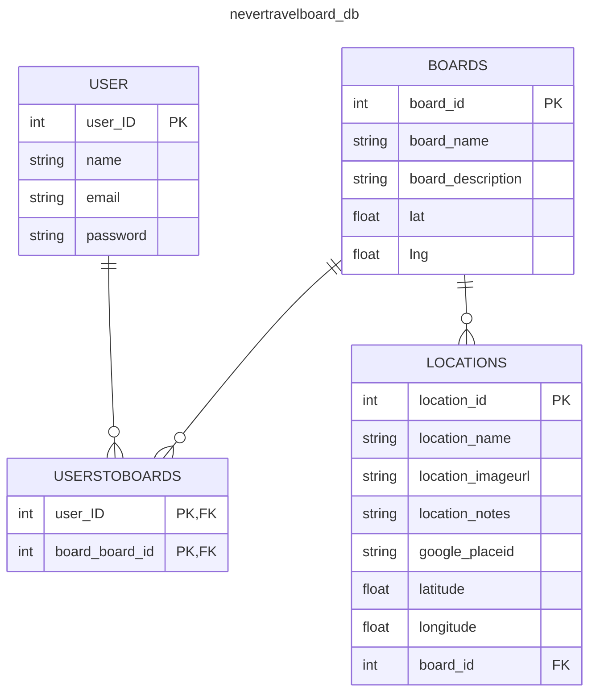

# Resource Links

Requirements
============
Project requirements
https://docs.google.com/presentation/d/1yIYYYI9UAmr8LE8owcGIGKo6Rdx6t1MsXoqp4vgwZ3s/edit#slide=id.gcf9fa50de2_0_2287

Wireframe
=========

Product Requirement Doc (example)
https://app.eraser.io/workspace/b8W3UBwaZwfLWzeAo2nD?origin=

Wireframe
https://app.eraser.io/workspace/nr7FTYY0He28ZEiO5kUC?origin=

APIs
====

- Google Places API\
  https://developers.google.com/maps/documentation/places/web-service/overview
  
- Google Maps API\
  https://developers.google.com/maps/documentation/javascript \
  https://developers.google.com/maps/documentation/javascript/examples/marker-labels --- Google Map Marker API \
  https://googlemaps.github.io/js-samples/
  
- TripAdvisor API (unused)\
  https://tripadvisor-content-api.readme.io/reference/getlocationdetails
  
- Getting Started with the Yelp Fusion API (unused)\
  https://docs.developer.yelp.com/docs/fusion-intro
  

Database Diagram Tool
=====================

Quick Database Diagrams (QuickDBD) is a simple online tool to quickly draw database diagrams by typing.

https://www.quickdatabasediagrams.com/  ->  Go to Try The App

QuickDBD database schema
========================
Use QuickDBD to render the EER diagram
https://app.quickdatabasediagrams.com/#/

Userstoboards
-
user_id PK FK >- User.id
board_board_id PK FK >- Boards.board_id

Boards
-
board_id PK int
board_name string
board_description string

Filters
-
board_id PK FK >- Boards.board_id
filter_name PK string

Locations
-
board_id FK >- Boards.board_id
location_id PK int
location_order int
location_name string
location_imageurl string
location_notes string
location_duration time
tripadvisor_placeid string
google_placeid string
latitude float
longitude float

User
-
id PK int
name string
email string
password string

[Mermaid diagram](https://mermaid.live/edit#pako:eNp9U9FugjAU_ZWmz_ADvLm5JcZtLOLempgrvXZNSkvKrcui_vtAmCigfeOc0_acU-6B504iT3gcx8KSJoMJs7hHTx72aLYOvNzIrbBnAfq5BuWhEJbV6ymdreYZOx7j2B3YV_ayytZpByZMcMHZlPAtfZ6tF-nHv-hGc2i_mqUtsdaAluxz2RMVeW1Vx1ko8A4lscq9Lkk72yt2xgExAzSCrGqhk-jkvdGBK-NyaE69Y-xCT3rrNxegMHjzYL8jrEa0ck4Z3JQGctRyIpmmIHGEO6sGxE3Br8tB-uY9H73tlWpQT6jQbxbzqWomG8EC9LiFEqrqx3k5Yau3cvfm6BLoNunVDxVdZ-YRL9DXRmQ9DedTBadvrN3yJq7EHQRDTepTLYVALvu1OU_IB4x4KCUQdsPBkx2YqkZRanL-vZ2w86Cd_gAeAQzh)
========================

